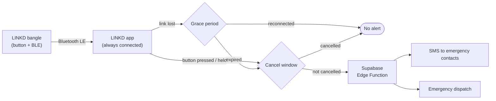

<div align="center">

# LINKD

**A safety bangle and companion app that sends an SOS without reaching for your phone.**


[How it works](#how-it-works) ·
[Repo structure](#repo-structure) ·
[Getting started](#getting-started) ·
[Workflow](#development-workflow) ·
[Docs](#documentation)

</div>

---

## Why LINKD

Women often need to call for help in situations where getting to a phone is slow or dangerous: take it out, unlock it, find the right app, tap through. Under fight-or-flight stress, every one of those steps costs time that may not be there.

**LINKD removes the steps.** A discreet bangle with one button stays linked to your phone. Press and hold it, or have the link cut, and your chosen contacts and local authorities are alerted.

## How it works



| Trigger | What happens |
|---|---|
| **Press / hold the button** | The bangle notifies the app, a short cancel window starts, then alerts go out. |
| **Link severed** | If the bangle is ripped off or the phone is taken, the app waits a grace period, then starts the cancel window. |
| **Battery dying** | The bangle warns before shutdown, so a dead battery is **never** mistaken for an emergency. |

> [!IMPORTANT]
> LINKD is a safety product. A missed alert and a false alert are both treated as serious defects. See the [SOS alert flow](docs/design/sos_alert_flow.md) for the behavior the code must follow.

### The app

- Pairs with and stays connected to the bangle, in the background.
- Manages the account, emergency contacts, and alert settings.
- Shows link status and battery life, and warns early when the coin cell needs replacing.
- Sends alerts via SMS to contacts and via a professional dispatch service.

### The bangle (v1 hardware)

| Part | Choice |
|---|---|
| SoC | Nordic nRF52832 / nRF52840 / nRF54L15 (pre-certified module for prototypes) |
| Power | User-replaceable coin cell (CR2025 / CR2032), sealed hatch on the inner face |
| Input | Sealed low-profile tactile button |
| Protection | Reverse-polarity protection, bulk capacitor for radio bursts |
| Antenna | Chip or PCB trace antenna behind a non-metal window |
| Board | Flex / rigid-flex PCB following the bangle curve |

*Not in v1:* haptic motor, status LED, accelerometer.

## Tech stack

| Layer | Technology |
|---|---|
| Mobile app | React Native + Expo (dev builds), expo-router, TypeScript |
| Bluetooth | react-native-ble-plx, shared protocol in `packages/ble-protocol` |
| Backend | Supabase: Postgres + row-level security, Auth, Edge Functions |
| Alerts | Twilio (SMS), Noonlight or RapidSOS (dispatch, vendor TBD) |
| Testing | Jest + React Native Testing Library, pgTAP, Deno test |
| Builds | EAS Build + EAS Update |
| Firmware | Nordic nRF SDK (toolchain TBD, not started) |

## Repo structure

```
linkd/
├── apps/
│   └── mobile/            # Expo app
├── packages/
│   └── ble-protocol/      # Single source of truth for app <-> bangle messages
├── supabase/
│   ├── migrations/        # Schema + RLS
│   ├── functions/         # Edge Functions (send-alert, dispatch, ...)
│   └── tests/             # pgTAP tests
├── firmware/              # Bangle firmware (planned)
├── docs/                  # Protocols, design specs, decisions
└── .claude/               # Claude Code agents + skills
```

> [!NOTE]
> The app, packages, and Supabase folders are created by the first scaffolding issues. Today the repo holds the working agreement and design drafts.

## Getting started

### Prerequisites

- Node.js LTS + npm
- [Expo CLI](https://docs.expo.dev/) and an [EAS](https://expo.dev/eas) account
- [Supabase CLI](https://supabase.com/docs/guides/cli) + Docker (for the local stack)
- Xcode (iOS) and/or Android Studio (Android)
- **A physical phone.** Simulators cannot use Bluetooth.

### Setup

```bash
git clone <repo-url> linkd
cd linkd
npm install
```

```bash
supabase start
```

```bash
cd apps/mobile && npx expo run:ios
```

Environment variables for each service are listed in [integrations.md](docs/reference/integrations.md). Copy `.env.example` to `.env` and fill it in; never commit secrets.

## Development workflow

Work is tracked in **GitHub Issues** and built with Claude Code using the rules in [CLAUDE.md](CLAUDE.md).

1. **Pick an issue** labeled `ready`: `/session-start`
2. **Branch** off `main`: `feature/<issue#>-<slug>` or `bugfix/<issue#>-<slug>`
3. **Build it.** Safety-critical code (alert logic, BLE codec, alert fan-out, RLS) is written **test-first**.
4. **Open a PR** with `Closes #<n>`: `/session-end`
5. **CI green + on-device QA** for anything BLE, background, or alert-path, then a developer merges.

| Skill | Use it to |
|---|---|
| `/new-issue` | Capture work as a GitHub issue |
| `/new-screen` | Add an app screen (test first) |
| `/new-migration` | Change the database schema + RLS |
| `/new-edge-function` | Add server logic like SMS or dispatch |
| `/ble-change` | Change the bangle protocol on both sides |
| `/new-design` | Resolve open design questions one at a time |

## Documentation

| Doc | What's in it |
|---|---|
| [SOS alert flow](docs/design/sos_alert_flow.md) | Triggers, timers, recipients, open questions |
| [BLE link spec](docs/design/ble_link_spec.md) | Messages between the bangle and the app |
| [Locked decisions](docs/reference/locked_decisions.md) | What is settled and what is still open |
| [Core protocol](docs/protocol/core_protocol.md) | Testing, branching, layout, conventions |
| [QA protocol](docs/protocol/qa_protocol.md) | On-device safety test scenarios |
| [Docs index](docs/README.md) | Everything else |

## Roadmap

- [ ] Scaffold Expo app, `packages/ble-protocol`, and Supabase project
- [ ] Resolve open questions in the SOS alert flow (timers, gesture, offline fallback)
- [ ] Bangle pairing + background connection on iOS and Android
- [ ] Emergency contacts + SMS alerts (sandbox)
- [ ] Choose a dispatch vendor and integrate
- [ ] Firmware prototype on a pre-certified nRF module

## License

_Not yet chosen._
