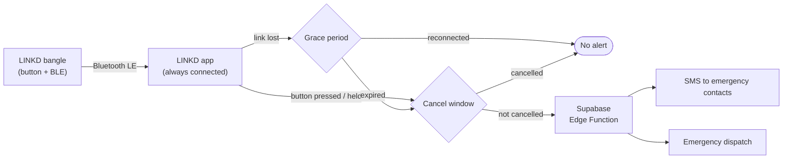

<div align="center">

# LINKD

**A safety bangle and companion app that sends an SOS without reaching for your phone.**


[How it works](#how-it-works) ·
[Repo structure](#repo-structure) ·
[Getting started](#getting-started) ·
[Workflow](#development-workflow) ·
[Docs](#documentation)

</div>

---

## Why LINKD

Women often need to call for help in situations where getting to a phone is slow or dangerous: take it out, unlock it, find the right app, tap through. Under fight-or-flight stress, every one of those steps costs time that may not be there.

**LINKD removes the steps.** A discreet bangle with one button stays linked to your phone. Press and hold it, or have the link cut, and your chosen contacts and local authorities are alerted.

## How it works


```mermaid
flowchart LR
    B["LINKD bangle<br/>(button + BLE)"] -- "Bluetooth LE" --> A["LINKD app<br/>(always connected)"]
    A -- "button pressed / held" --> C{"Cancel window"}
    A -- "link lost" --> G{"Grace period"}
    G -- "reconnected" --> OK(["No alert"])
    G -- "expired" --> C
    C -- "cancelled" --> OK
    C -- "not cancelled" --> S["Supabase<br/>Edge Function"]
    S --> SMS["SMS to emergency contacts"]
    S --> D["Emergency dispatch"]
```

| Trigger | What happens |
|---|---|
| **Press / hold the button** | The bangle notifies the app, a short cancel window starts, then alerts go out. |
| **Link severed** | If the bangle is ripped off or the phone is taken, the app waits a grace period, then starts the cancel window. |
| **Battery dying** | The bangle warns before shutdown, so a dead battery is **never** mistaken for an emergency. |

> [!IMPORTANT]
> LINKD is a safety product. A missed alert and a false alert are both treated as serious defects. See the [SOS alert flow](docs/design/sos_alert_flow.md) for the behavior the code must follow.

### The app

- Pairs with and stays connected to the bangle, in the background.
- Manages the account, emergency contacts, and alert settings.
- Shows link status and battery life, and warns early when the coin cell needs replacing.
- Sends alerts via SMS to contacts and via a professional dispatch service.

### The bangle (v1 hardware)

| Part | Choice |
|---|---|
| SoC | Nordic nRF52832 / nRF52840 / nRF54L15 (pre-certified module for prototypes) |
| Power | User-replaceable coin cell (CR2025 / CR2032), sealed hatch on the inner face |
| Input | Sealed low-profile tactile button |
| Protection | Reverse-polarity protection, bulk capacitor for radio bursts |
| Antenna | Chip or PCB trace antenna behind a non-metal window |
| Board | Flex / rigid-flex PCB following the bangle curve |

*Not in v1:* haptic motor, status LED, accelerometer.

## Tech stack

| Layer | Technology |
|---|---|
| Mobile app | React Native + Expo (dev builds), expo-router, TypeScript |
| Bluetooth | react-native-ble-plx, shared protocol in `packages/ble-protocol` |
| Backend | Supabase: Postgres + row-level security, Auth, Edge Functions |
| Alerts | Twilio (SMS), Noonlight or RapidSOS (dispatch, vendor TBD) |
| Testing | Jest + React Native Testing Library, pgTAP, Deno test |
| Builds | EAS Build + EAS Update |
| Firmware | Nordic nRF SDK (toolchain TBD, not started) |

## Repo structure

```
linkd/
├── apps/
│   └── mobile/            # Expo app
├── packages/
│   └── ble-protocol/      # Single source of truth for app <-> bangle messages (planned)
├── supabase/
│   ├── config.toml        # Local stack config
│   ├── migrations/        # Schema + RLS (planned)
│   ├── functions/         # Edge Functions (send-alert, dispatch, ...) (planned)
│   └── tests/             # pgTAP tests (planned)
├── firmware/              # Bangle firmware (planned)
├── docs/                  # Protocols, design specs, decisions
└── .claude/               # Claude Code agents + skills
```

> [!NOTE]
> `packages/ble-protocol/` and `firmware/` do not exist yet - they are created when the bangle hardware is confirmed. `supabase/` holds config only; migrations, functions, and tests arrive with the first backend issue.

## Getting started

The repo sets up the same way on Windows and macOS. Everything below is identical on both, except the platform prerequisites and the fact that **iOS builds require macOS** - Windows developers test on Android.

### Shared prerequisites

| Tool | Why | Notes |
|---|---|---|
| **Node** (version in [`.nvmrc`](.nvmrc)) | Runs everything | Install with [fnm](https://github.com/Schniz/fnm): `fnm install` reads `.nvmrc`. `engine-strict=true` means npm refuses to install on the wrong major version rather than failing strangely later. |
| **Git** | Source control | |
| **Docker Desktop** | Local Supabase stack | Must be running before `npx supabase start`. |
| **Android Studio + SDK** | Android builds | SDK Platform 36 (Android 16), Android SDK Build-Tools. |
| **JDK 17** | Android builds | Azul Zulu 17 on macOS, Microsoft OpenJDK 17 on Windows, per the [Expo setup guide](https://docs.expo.dev/get-started/set-up-your-environment/?platform=android&device=physical&mode=development-build). |
| **A physical phone** | Bluetooth | Simulators cannot do BLE, so there is no way to test the bangle link without one. |

The Expo and Supabase CLIs are **not** installed globally - both come from this repo's dev dependencies and run through `npx`, so everyone gets the same version.

### macOS only

- **Xcode** from the Mac App Store, plus Xcode Command Line Tools, for iOS builds.
- `export ANDROID_HOME=$HOME/Library/Android/sdk` and `JAVA_HOME` in `~/.zshrc`.
- Watchman is **not** needed: Expo requires it only for SDK 55 and earlier, and this app is on SDK 57.

### Windows only

- **`ANDROID_HOME`** must be set (System Properties -> Environment Variables), normally `%LOCALAPPDATA%\Android\Sdk`.
- **Long paths must be enabled**, or `npm ci` fails deep inside `node_modules`:

  ```
  git config --global core.longpaths true
  ```

  and enable the OS setting (Local Group Policy `Enable Win32 long paths`, or set
  `HKLM\SYSTEM\CurrentControlSet\Control\FileSystem\LongPathsEnabled` to `1`), then reboot.
- iOS builds are not possible. Test on Android; a teammate on macOS covers iOS.

### Setup

```bash
git clone <repo-url> linkd
cd linkd
fnm install && fnm use
npm ci
```

`npm ci` rather than `npm install`: it installs exactly what [`package-lock.json`](package-lock.json) pins, so two machines cannot drift apart.

Then copy the env file and fill it in. Names and purposes are in [integrations.md](docs/reference/integrations.md); never commit values.

```bash
cp .env.example .env
```

### Check the setup

```bash
npm run doctor
```

That runs `expo-doctor` in the app workspace. It is the setup check: it validates the native project, dependency versions against the Expo SDK, and config. Run it before asking why a build fails. Then the three checks CI runs on every PR, on every OS:

```bash
npm run typecheck
npm run lint
npm test
```

Local Supabase stack (Docker must be running):

```bash
npx supabase start
```

### Running the app

The app needs a **development build**, not Expo Go - Bluetooth requires native code. With a phone connected by USB:

```bash
npm run android -w @linkd/mobile    # Windows or macOS
npm run ios -w @linkd/mobile        # macOS only
```

After the first build, `npm start -w @linkd/mobile` starts the dev server against the installed dev build.

## Development workflow

Work is tracked in **GitHub Issues** and built with Claude Code using the rules in [CLAUDE.md](CLAUDE.md).

1. **Pick an issue** labeled `ready`: `/session-start`
2. **Branch** off `main`: `feature/<issue#>-<slug>` or `bugfix/<issue#>-<slug>`
3. **Build it.** Safety-critical code (alert logic, BLE codec, alert fan-out, RLS) is written **test-first**.
4. **Open a PR** with `Closes #<n>`: `/session-end`
5. **CI green + on-device QA** for anything BLE, background, or alert-path, then a developer merges.

| Skill | Use it to |
|---|---|
| `/new-issue` | Capture work as a GitHub issue |
| `/new-screen` | Add an app screen (test first) |
| `/new-migration` | Change the database schema + RLS |
| `/new-edge-function` | Add server logic like SMS or dispatch |
| `/ble-change` | Change the bangle protocol on both sides |
| `/new-design` | Resolve open design questions one at a time |

## Documentation

| Doc | What's in it |
|---|---|
| [SOS alert flow](docs/design/sos_alert_flow.md) | Triggers, timers, recipients, open questions |
| [BLE link spec](docs/design/ble_link_spec.md) | Messages between the bangle and the app |
| [Locked decisions](docs/reference/locked_decisions.md) | What is settled and what is still open |
| [Core protocol](docs/protocol/core_protocol.md) | Testing, branching, layout, conventions |
| [QA protocol](docs/protocol/qa_protocol.md) | On-device safety test scenarios |
| [Docs index](docs/README.md) | Everything else |

## Roadmap

- [ ] Scaffold Expo app, `packages/ble-protocol`, and Supabase project
- [ ] Resolve open questions in the SOS alert flow (timers, gesture, offline fallback)
- [ ] Bangle pairing + background connection on iOS and Android
- [ ] Emergency contacts + SMS alerts (sandbox)
- [ ] Choose a dispatch vendor and integrate
- [ ] Firmware prototype on a pre-certified nRF module

## License

_Not yet chosen._
